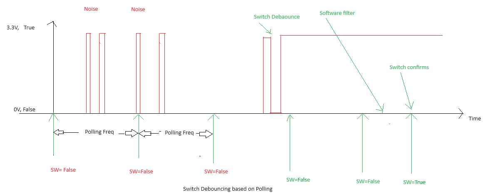

# swDebPolMgr

__Copyright (c) 2023 - 2030 Firmware module swDebPolMgr Project by Nandkumar Ganesh Dhavalikar

# Table of Contents
1. [Overview](#overview)
2. [Design](#design)
3. [Module Configs](#module-configs)
4. [Module Integration](#module-integration)
5. [Constraints](#constraints)

## Requirements
- store debauce values
- create event optional on chnage i.e (rising and falling) edge after debounce.
## Overview
maximum 32 switches are supported

## Design

## Module Configs

## Module Integration
